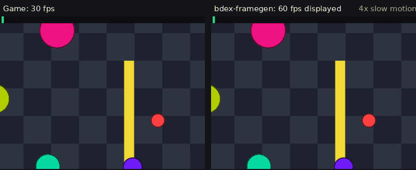
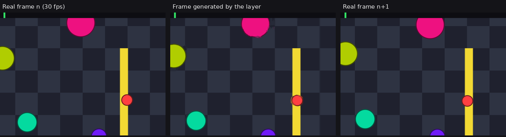
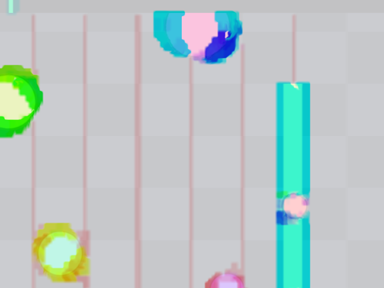

<div align="center">

# bdex-framegen

**Frame generation for Vulkan games on Linux — one layer, no changes to the game.**

[](LICENSE)
[](#)
[](#)
[](#)
[](#validation)

30 fps rendered → **60, 90 or 120 fps displayed**, on any Vulkan game
(native, or Direct3D through DXVK / VKD3D-Proton).



*The demo as the game renders it at 30 fps (left) and what the layer displays (right), in 4x slow motion: every other frame is synthesised.*

</div>

---

## Contents

- [How it works](#how-it-works)
- [Which games](#which-games)
- [Installation](#installation)
- [Usage](#usage)
- [Configuration](#configuration)
- [Performance and quality](#performance-and-quality)
- [Limitations](#limitations)
- [Validation](#validation)
- [Development](#development)
- [Layout](#layout)
- [Contributing](#contributing)

---

## How it works

`bdex-framegen` is an **implicit Vulkan layer** (`VK_LAYER_BDEX_framegen`).
It sits between the game and the graphics driver, grabs every frame the game
presents, estimates the motion between two consecutive frames, and inserts
one or more intermediate frames before the real one.

```
Game ──► vkQueuePresentKHR ──► [ bdex-framegen ] ──► display
                                      │
      game thread (≈ 0.1 ms):         │
      ├─ luma pyramid + hierarchical block matching
      │  (forward and backward optical flow, median filter, 4×4 refinement)
      └─ synthesis of the intermediate frames: bidirectional warping
         weighted by photometric consistency, scene cut detection,
         cross-fade in occluded regions
                                      │
      presentation thread:            │
      └─ copy into the real swapchain, pacing, presentation:
         generated frame(s), then the real frame
```

Design notes:

| | |
|---|---|
| **Virtual swapchain** | The game renders into private images handed out by the layer. The real swapchain belongs to the layer, which decides what to present and when. |
| **Dedicated thread** | The game is never blocked by the presentation of generated frames: `vkQueuePresentKHR` costs it ≈ 0.1 ms. |
| **Separate queue** | The layer's work runs on a compute queue distinct from the game's whenever the GPU has one. |
| **No frame copies** | The images the game renders into double as the frame history: nothing is copied before the analysis. |
| **Latency first** | FIFO is replaced by mailbox + pacing (queued frames are pure display latency), and an extrapolation mode predicts the next frame instead of holding the real one back. |
| **All on the GPU** | Five compute shaders (pyramid, matching, median, refinement, interpolation), no CPU round trip. |
| **Scene cuts** | When the motion cannot be explained, the layer shows the real frame rather than a blend. |



*The middle frame was never rendered by the game: it is synthesised from the two neighbouring frames.*

<details>
<summary>See the estimated optical flow (<code>BDEX_FG_DEBUG=flow</code>)</summary>
<br>


*Hue = motion direction, saturation = magnitude. The static HUD stays grey.*
</details>

---

## Which games

The layer works on anything that presents through a Vulkan swapchain. That
covers more than native Vulkan games:

| Game | How | Status |
|---|---|---|
| Native Linux Vulkan | `BDEX_FG=1 game` | Works (demo, `vkcube`, `vkgears`) |
| Windows Direct3D 8–12 through Steam Play / Proton | `BDEX_FG=1 %command%` — DXVK and VKD3D-Proton translate to Vulkan | **Works** — verified on DXVK (Direct3D 11) and VKD3D-Proton (Direct3D 12) titles |
| Windows games outside Steam (Wine, Lutris, Heroic, Bottles) | Enable DXVK in the runner and set `BDEX_FG=1` in the environment | Same as above |
| Native Linux **OpenGL** | `bdex-framegen --gl -- game`, i.e. `MESA_LOADER_DRIVER_OVERRIDE=zink`: Mesa's Zink runs OpenGL on Vulkan | Works (`glxgears`, an SDL3 game); Zink itself can be slower than the native GL driver on some games and iGPUs |
| Emulators, 2D engines, anything else | Run it inside [gamescope](https://github.com/ValveSoftware/gamescope) with `BDEX_FG=1 gamescope -- game`: the compositor presents the whole game through its own Vulkan swapchain | Untested |
| Software rendering / no GPU presentation | — | Not possible |

The layer never sees game logic or input: it only interpolates what reaches
the display, so gameplay, anti-cheat interaction and mods are unaffected.
Steam's overlay and MangoHud sit in the same layer chain and keep working.

---

## Installation

### Requirements

- Linux, Vulkan 1.0+ (loader ≥ 1.3.234), a GPU with compute support (RADV, ANV, NVIDIA…)
- To build: CMake ≥ 3.20, a C++20 compiler, `glslc` (shaderc), the Vulkan headers; GLFW (optional) for the demo

```sh
# Arch Linux
sudo pacman -S cmake gcc vulkan-headers shaderc glfw vulkan-tools
```

### One command

```sh
tools/install.sh      # builds and installs into ~/.local (64-bit, plus 32-bit with multilib)
```

The installation drops:

```
~/.local/lib/libVkLayer_bdex_framegen.so
~/.local/lib32/libVkLayer_bdex_framegen.so                      (32-bit games)
~/.local/share/vulkan/implicit_layer.d/VK_LAYER_BDEX_framegen.json
~/.local/share/vulkan/implicit_layer.d/VK_LAYER_BDEX_framegen_32.json
~/.local/bin/bdex-framegen                                      (launcher)
```

Uninstall: `tools/uninstall.sh`.

<details>
<summary>Manual build</summary>

```sh
cmake -S . -B build -DCMAKE_BUILD_TYPE=Release
cmake --build build -j
cmake --install build --prefix ~/.local

# 32-bit variant (multilib required)
cmake -S . -B build32 -DCMAKE_BUILD_TYPE=Release -DBDEX_32BIT=ON
cmake --build build32 -j && cmake --install build32 --prefix ~/.local
```
</details>

---

## Usage

Once installed the layer loads into **every** Vulkan game automatically, but
stays a pure pass-through — it does nothing until you turn it on. There is
nothing to add to your Steam launch options.

### Control panel (recommended)

Run **`bdex-framegen-gui`** (or `bdex-framegen --gui`, or the *bdex-framegen*
entry in the applications menu) once, the way you would open Lossless Scaling:

* flip **frame generation on**, either globally (*Activer pour tous les jeux
  Vulkan*) or for a chosen list of games you add with **+**;
* set the quality preset, multiplier, mode, upscaling and present mode.

Everything is written to `~/.config/bdex-framegen.conf`, which the layer reads
on its own. Then just **launch your games normally through Steam** — no launch
options. Changes take effect the next time a game starts. The panel needs
PyGObject with GTK 4 and libadwaita (packages `python-gobject`, `gtk4`,
`libadwaita`).

### Turning it on by hand

`~/.config/bdex-framegen.conf` is a plain INI file. `[*]` applies to every game;
a `[name]` section applies to the game whose executable is `name`:

```ini
[*]
enabled = 0            # off for everything by default
preset  = balanced

[kenshi]
enabled = 1            # ...but on for Kenshi, no launch options needed
multiplier = 3
```

### Environment variables (per-game, still supported)

Setting `BDEX_FG=1` turns the layer on for a single process, overriding the
config file — handy for a one-off, from the command line, or as a per-game
Steam launch option:

```sh
BDEX_FG=1 ./my_game                      # x2 (default)
bdex-framegen -m 3 -- ./my_game          # x3 through the launcher
bdex-framegen -x -- ./my_game            # extrapolation: no added latency
bdex-framegen --preset performance --profile -- vkcube
bdex-framegen --check                    # does the loader find the layer?
```

**Steam** → game properties → *Launch options*:

```
BDEX_FG=1 %command%
BDEX_FG=1 BDEX_FG_MULTIPLIER=3 BDEX_FG_MODE=extrapolate %command%
```

Without installing, from the build tree:

```sh
VK_ADD_IMPLICIT_LAYER_PATH=$PWD/build/layer BDEX_FG=1 ./build/demo/bdex_demo --fps 30
```

The layer periodically prints its statistics to the terminal:

```
[bdex-fg  4.128 INFO] game 30.0 fps -> output 60.0 fps (x2.00), present call 0.14 ms, real frame delayed 17.1 ms
```

### The demo

`bdex_demo` renders a procedural scene (moving objects, static HUD, frame
counter) at a capped frame rate, to test without a game:

```sh
build/demo/bdex_demo --fps 30               # without the layer: 30 fps
BDEX_FG=1 build/demo/bdex_demo --fps 30     # with it: 60 fps displayed
build/demo/bdex_demo --help                 # --size, --mode, --speed, --cut, --srgb…
```

---

## Configuration

Every option can be set through `BDEX_FG_<KEY>` environment variables or in
`~/.config/bdex-framegen.conf` (`key = value`, one per line; the environment
takes precedence).

| Key | Default | Description |
|---|:---:|---|
| `BDEX_FG` | – | `1` enables the layer, `0` disables it |
| `MULTIPLIER` | `2` | frames displayed per rendered frame: 2, 3 or 4 |
| `MODE` | `interpolate` | `extrapolate` predicts the next frame from the last two: no added latency, more artefacts on abrupt motion |
| `PRESET` | `auto` | `auto` picks the flow quality from the GPU (integrated / small → `performance`, discrete → `balanced`); or force `quality` (full-resolution flow, ~3× the cost), `balanced`, `performance` (quarter-resolution flow, ~2× cheaper), `latency` (extrapolation + x2 for minimal input lag) |
| `FLOW_SCALE` | `auto` | resolution divisor of the flow: `1`, `2`, `4`; `auto` keeps the flow around 0.5 Mpixel |
| `LEVELS` | `4` | flow pyramid levels (1–6) |
| `SEARCH` / `SEARCH_FINE` | `4` / `2` | search radius at the coarsest level / at the finer levels (1–4) |
| `RENDER_SCALE` | `1.0` | render resolution / display resolution (`0.5`–`1.0`); below 1 the game renders smaller and every frame is upscaled to the display size. `UPSCALE=<ratio>` sets it as a ratio (e.g. `1.5`). X11 / Xwayland only |
| `UPSCALE_FILTER` | `lanczos` | upscaling reconstruction filter: `bilinear`, `bicubic` (Catmull-Rom) or `lanczos` (Lanczos-2) |
| `SHARPNESS` | `0` | contrast-adaptive sharpening (CAS) after upscaling, `0` (off) to `1` (strong); applies to real and generated frames |
| `OVERLAY` | `0` | on-screen fps counter in the top-left of every frame (alias `HUD`). Level `0` off, `1` output fps, `2` `game > output`, `3` adds the `1%` low, `4` adds the `.1%` low. Also accepts `off`/`fps`/`framegen`/`low`/`full`. The lows are the game fps at the 99th / 99.9th percentile frame time |
| `REFINE` / `REFINE_ALL` | `1` / `1` | 4×4 flow refinement pass, on every level or only the finest |
| `FLOW_ITERATIONS` | `1` | fixed-point iterations of the flow lookup in the interpolation (0–3) |
| `PRESENT_MODE` | `auto` | `auto` presents with mailbox when the game asks for FIFO; `app` keeps the game's mode; or force `fifo`, `mailbox`, `immediate`, `relaxed` |
| `PACING` | `1` | even spacing of the frames in non-FIFO modes |
| `LOW_LATENCY` | `0` | block the game until its previous frame has been handed to the display (only matters with FIFO) |
| `SCENE_CUT_LOW` / `SCENE_CUT_HIGH` | `0.05` / `0.09` | scene cut detection thresholds |
| `DEBUG` | `none` | `flow` (visualise the flow), `split` (left generated / right real), `passthrough` |
| `STATS` / `STATS_INTERVAL` | `1` / `5` | terminal statistics, period in seconds |
| `PROFILE` | `0` | GPU time per stage in the statistics |
| `LOG` / `LOG_FILE` | `1` / – | verbosity 0–3, output file |
| `DUMP` / `DUMP_FRAMES` | – / `24` | write the presented frames (PPM) into a directory |
| `SHARED_QUEUE` | `0` | force sharing the game's queue (testing) |

### Per-game settings

The configuration file accepts `[name]` sections that only apply to processes
whose command line contains an executable of that name (`.exe` optional,
case-insensitive):

```ini
# ~/.config/bdex-framegen.conf
multiplier = 2
log = 1

[Cyberpunk2077.exe]
multiplier = 3
present_mode = mailbox

[vkcube]
debug = flow
```

---

## Performance and quality

GPU time per rendered frame, measured with `BDEX_FG_PROFILE=1` on an
integrated **AMD Radeon Vega 8** (≈ 1.1 TFLOPS, laptop on battery), demo
fullscreen at 1920×1080, x2:

| Preset | Analysis | Flow | Interpolation | Copies | Total |
|---|:---:|:---:|:---:|:---:|:---:|
| `performance` | 0.5 ms | 0.6 ms | 1.5 ms | 1.6 ms | ≈ 4.2 ms |
| `balanced` (default) | 0.6 ms | 2.4 ms | 1.5 ms | 1.6 ms | ≈ 6.1 ms |
| `quality` | 1.1 ms | 8.8 ms | 1.7 ms | 1.6 ms | ≈ 13 ms |

The copies are the two 8 MB transfers into the real swapchain (generated +
real frame); on this iGPU they are memory-bound. On a discrete GPU the whole
budget is well under a millisecond. The game thread spends ≈ 0.1 ms in
`vkQueuePresentKHR`; the layer adds one image to the game's swapchain and
allocates `multiplier - 1` full-resolution output images plus the flow
pyramids (a few megabytes).

Quality measured with `tools/run_eval.sh` (PSNR of the generated frames
against the real frame rendered at 60 fps):

| Method | PSNR |
|---|:---:|
| Duplicating the previous frame | ≈ 22 dB |
| Blending the two neighbouring frames | ≈ 25 dB |
| **bdex-framegen**, `performance` | ≈ 27 dB |
| **bdex-framegen**, `balanced` | **≈ 30 dB** |
| **bdex-framegen**, `quality` | ≈ 31 dB |
| **bdex-framegen**, `MODE=extrapolate` | ≈ 23 dB |

### Latency

Delay between the game's `vkQueuePresentKHR` and the moment the real frame
is handed to the presentation engine (`real frame delayed` in the
statistics), demo at 30 fps on a 60 Hz display:

| Configuration | Real frame delay |
|---|:---:|
| Game's FIFO kept (`PRESENT_MODE=app`) | ≈ 60 ms (frames queue up in the presentation engine) |
| Default (`auto` → mailbox, interpolation) | ≈ 17 ms (half a game frame, by construction) |
| `MODE=extrapolate` | **≈ 0.5 ms** |

**For the lowest input lag, use `--preset latency` (or `-x`)**: it selects
extrapolation with x2 and the default mailbox present mode. Measured on a
discrete GPU (game 60 fps → 120 fps) the real frame is held ≈ 0.1 ms, versus
≈ 8 ms for interpolation at the same rate. Keep x2 and mailbox — x3, `fifo`
and `immediate` all give up that gain. `LOW_LATENCY` does **not** help on top
of extrapolation (it only throttles the game so it cannot run ahead, which
matters with FIFO); leave it off here.

Interpolation must hold the real frame back by half a frame interval to show
the in-between frame first; extrapolation shows the real frame immediately
and predicts the following one from the motion of the last two, at the cost
of prediction errors on abrupt changes of direction. Predicted frames that
are still pending when the next real frame arrives are skipped rather than
delaying it.

---

## Limitations

- **Latency**: interpolation displays the real frame half a frame later (at
  x2); `MODE=extrapolate` removes that delay but predicts. Input is not touched.
- **Vsync**: by default the layer presents with mailbox (no tearing, no
  queueing). With `PRESENT_MODE=app` and a FIFO game on a 60 Hz display, x2
  caps the game at 30 fps, x3 at 20 fps, and queued frames add latency.
- **Artefacts**: block-matching optical flow handles translations and static
  HUDs well; fast rotations, large occlusions and repetitive patterns produce
  local artefacts. `DEBUG=flow` shows what the layer "understands" of the
  motion.
- **Supported formats**: 8-bit RGBA/BGRA (UNORM and sRGB),
  A2B10G10R10 / A2R10G10B10, RGBA16F. Others pass through without generation.
- Not supported (passed through): multi-layer (VR) and protected swapchains.
- Handled extensions: `VK_KHR_present_id` / `present_wait`,
  `VK_EXT_swapchain_maintenance1` (present fences, present mode switching,
  `vkReleaseSwapchainImagesEXT`).

---

## Validation

The layer is clean under `VK_LAYER_KHRONOS_validation`, synchronization
validation included, with the demo, `vkcube` and `vkgears`:

```sh
VK_LOADER_LAYERS_ENABLE='*validation' BDEX_FG=1 build/demo/bdex_demo --fps 30 --frames 90
```

It also loads inside the Steam Linux Runtime container (pressure-vessel).

---

## Development

```sh
cmake -S . -B build && cmake --build build -j
ctest --test-dir build --output-on-failure     # unit tests + end-to-end test
tools/run_eval.sh build 40                      # PSNR against ground truth
BDEX_EVAL_ARGS="--speed 2.5" tools/run_eval.sh build 40   # fast-motion scene
```

`tools/run_eval.sh` renders the demo at 60 fps (reference) and then at 30 fps
through the layer, and compares each generated frame with the matching real
frame thanks to the frame counter drawn on screen.

---

## Layout

```
layer/
├─ src/layer.cpp        layer entry points, dispatch, Vulkan hooks
├─ src/swapchain.cpp    virtual swapchain (acquire / present, presentation thread)
├─ src/framegen.cpp     GPU resources and pass recording
├─ src/config.cpp       options (environment, file, per-game sections)
└─ shaders/             downsample, block_match, flow_smooth, flow_refine, interpolate
demo/                   GLFW test application (procedural scene)
tests/                  unit tests and integration test
tools/                  launcher, install/uninstall, quality evaluation
```

---

## Contributing

Reports from real games (DXVK, VKD3D-Proton, NVIDIA, Intel…) are what the
project needs most: open an issue with the layer log (`BDEX_FG_LOG=2`), your
GPU and how the game is launched.

To contribute code, read [CONTRIBUTING.md](CONTRIBUTING.md): setup, what to
check before a pull request (tests, Khronos validation, quality and
performance measurements) and code conventions. The version history is in
[CHANGELOG.md](CHANGELOG.md).

---

<div align="center">

[MIT](LICENSE) licensed.

</div>
